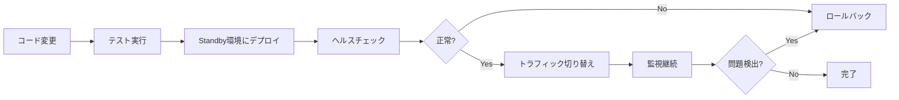
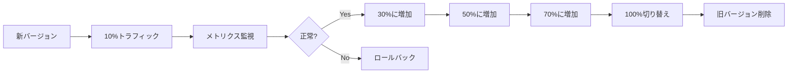

# 🚀 デプロイメントシステム

## 概要

my-board-appは、Blue-Green デプロイメントとカナリアリリースをサポートする高度なデプロイメントシステムを実装しています。これにより、ゼロダウンタイムでの安全なデプロイメントが可能です。

## 📋 機能

### Blue-Green デプロイメント

- ✅ ゼロダウンタイムデプロイメント
- ✅ 即座のロールバック機能
- ✅ 自動ヘルスチェック
- ✅ トラフィック自動切り替え

### カナリアリリース

- ✅ 段階的なトラフィック増加
- ✅ リアルタイムメトリクス監視
- ✅ 自動ロールバック（エラー率基準）
- ✅ A/Bテスト対応

## 🔧 セットアップ

### 必要な環境変数

```env
# Vercel
VERCEL_TOKEN=your_vercel_token
VERCEL_PROJECT_ID=your_project_id

# GitHub
GITHUB_TOKEN=your_github_token

# Monitoring (Optional)
SENTRY_DSN=your_sentry_dsn
SLACK_WEBHOOK_URL=your_slack_webhook
```

### GitHub Secrets設定

1. リポジトリの Settings → Secrets → Actions に移動
2. 以下のシークレットを追加：
   - `VERCEL_TOKEN`: Vercel APIトークン
   - `SLACK_WEBHOOK_URL`: Slack通知用（オプション）

## 📖 使用方法

### Blue-Green デプロイメント

#### GitHub Actions経由

1. Actions タブに移動
2. "Blue-Green Deployment" ワークフローを選択
3. "Run workflow" をクリック
4. パラメータを設定：
   - `environment`: staging または production
   - `strategy`: blue-green
   - `auto_switch`: 自動切り替えの有効/無効

#### CLI経由

```bash
# デプロイメントマネージャーの初期化
npm run deploy:init

# Blueにデプロイ
npm run deploy:blue -- --version v1.2.3

# Greenにデプロイ
npm run deploy:green -- --version v1.2.3

# トラフィック切り替え
npm run deploy:switch

# ロールバック
npm run deploy:rollback
```

### カナリアリリース

#### GitHub Actions経由

1. Actions タブに移動
2. "Canary Deployment" ワークフローを選択
3. "Run workflow" をクリック
4. パラメータを設定：
   - `environment`: staging または production
   - `initial_percentage`: 初期トラフィック割合
   - `increment_interval`: 増分間隔（分）

#### CLI経由

```bash
# カナリアデプロイメント開始
npm run canary:start -- --version v1.2.3 --percentage 10

# トラフィック調整
npm run canary:adjust -- --percentage 50

# カナリア完了（100%切り替え）
npm run canary:complete

# ロールバック
npm run canary:rollback
```

## 📊 モニタリング

### ヘルスチェック

```bash
# ヘルスチェックエンドポイント
curl https://your-app.com/api/health

# レスポンス例
{
  "status": "healthy",
  "version": "1.2.3",
  "environment": "production",
  "checks": {
    "database": true,
    "api": true,
    "auth": true,
    "storage": true
  },
  "responseTime": {
    "database": 45,
    "total": 120
  }
}
```

### メトリクス

```bash
# メトリクスエンドポイント
curl https://your-app.com/api/metrics

# レスポンス例
{
  "errorRate": 0.5,
  "canaryErrorRate": 0.3,
  "baselineErrorRate": 0.7,
  "canaryResponseTime": 150,
  "baselineResponseTime": 200,
  "canaryRequests": 1000,
  "baselineRequests": 9000
}
```

## 🔄 デプロイメントフロー

### Blue-Green フロー



### カナリアフロー



## ⚠️ 注意事項

### データベースマイグレーション

- Blue-Greenデプロイメント時は、後方互換性のあるマイグレーションのみ実行
- 破壊的変更は、メンテナンスウィンドウで実行

### セッション管理

- デプロイメント時のセッション継続性を確保
- Redisなどの外部セッションストアの使用を推奨

### キャッシュ

- デプロイメント後のキャッシュ無効化戦略を確立
- CDNキャッシュのパージを考慮

## 🛠️ トラブルシューティング

### デプロイメントが失敗する

1. ヘルスチェックログを確認
2. ビルドログを確認
3. 環境変数が正しく設定されているか確認

### ロールバックが必要

```bash
# 手動ロールバック（Blue-Green）
npm run deploy:rollback

# 手動ロールバック（カナリア）
npm run canary:rollback
```

### メトリクスが異常

1. `/api/metrics` エンドポイントを直接確認
2. エラーログを確認
3. 必要に応じてカナリアを一時停止

```bash
npm run canary:pause
```

## 📚 参考資料

- [Blue-Green Deployment Pattern](https://martinfowler.com/bliki/BlueGreenDeployment.html)
- [Canary Release Pattern](https://martinfowler.com/bliki/CanaryRelease.html)
- [Vercel API Documentation](https://vercel.com/docs/api)
- [GitHub Actions Documentation](https://docs.github.com/en/actions)

## 🤝 サポート

問題が発生した場合は、以下の方法でサポートを受けられます：

1. GitHubでIssueを作成
2. Slackの#deploymentチャンネルで質問
3. ドキュメントの[FAQ](#faq)セクションを確認

---

**Last Updated**: 2025-01-12
**Issue**: #62
