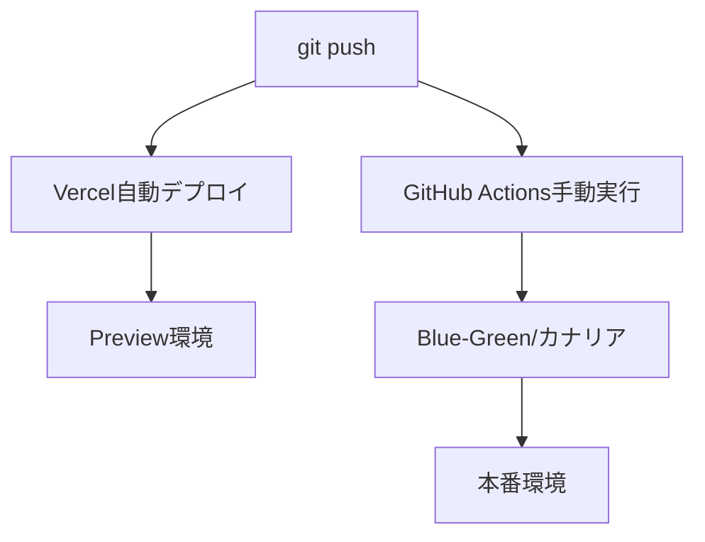

# 🤔 デプロイメントシステム vs 通常のVercelデプロイ

## 📊 比較表

| 項目             | 通常のVercelデプロイ     | デプロイメントシステム（Issue #62） |
| ---------------- | ------------------------ | ----------------------------------- |
| **実行方法**     | git pushで自動           | GitHub Actions手動実行              |
| **切り替え方式** | 即座に100%切り替え       | Blue-Green/カナリア選択可能         |
| **ロールバック** | 手動でVercelから         | 自動ロールバック機能あり            |
| **リスク管理**   | なし（全ユーザー即影響） | 段階的展開でリスク最小化            |
| **監視**         | Vercelダッシュボードのみ | ヘルスチェック・メトリクス自動監視  |
| **テスト**       | なし                     | デプロイ前に自動テスト実行          |
| **承認フロー**   | なし                     | 承認後にデプロイ可能                |
| **コスト**       | 無料                     | 無料（GitHub Actions無料枠内）      |

---

## 🎯 通常のVercelデプロイ（現在も動作中）

### 仕組み

```
git push → GitHub → Vercel自動検知 → ビルド → 即座にデプロイ（100%）
```

### メリット

- ✅ **超簡単** - pushするだけ
- ✅ **高速** - 2-3分でデプロイ完了
- ✅ **自動** - 何も考えなくていい

### デメリット

- ❌ **リスキー** - バグがあると全ユーザーに影響
- ❌ **ロールバック手動** - Vercelダッシュボードから操作必要
- ❌ **段階的展開不可** - 0% → 100%の二択のみ

### 使用例

```bash
# コード修正
git add .
git commit -m "fix: バグ修正"
git push origin main
# → 自動でVercelがデプロイ（2-3分後に本番反映）
```

---

## 🚀 デプロイメントシステム（Issue #62で実装）

### Blue-Green デプロイメント

```
新バージョンを別環境(Green)にデプロイ
→ ヘルスチェック
→ 問題なければトラフィック切り替え(Blue→Green)
→ 問題あれば即座に戻す(Green→Blue)
```

### カナリアデプロイメント

```
10%のユーザーに展開
→ エラー率監視
→ 問題なければ30%→50%→70%→100%
→ 問題あれば自動ロールバック
```

### メリット

- ✅ **安全** - 段階的展開でリスク最小化
- ✅ **自動ロールバック** - エラー検知で自動復旧
- ✅ **A/Bテスト可能** - 新旧バージョン並行運用
- ✅ **承認フロー** - チーム開発で安心

### デメリット

- ❌ **手動実行必要** - GitHub Actionsから実行
- ❌ **設定が複雑** - 初期設定が必要
- ❌ **時間がかかる** - 段階的展開は時間必要

---

## 🤝 両方を使い分ける（推奨）

### 実は両方が共存しています！



### 使い分け方

| シーン             | 使用するデプロイ方法          | 理由                 |
| ------------------ | ----------------------------- | -------------------- |
| **開発中の確認**   | Vercel自動デプロイ（Preview） | 素早く確認したい     |
| **緊急バグ修正**   | Vercel自動デプロイ（本番）    | 即座に修正必要       |
| **新機能リリース** | カナリアデプロイメント        | リスクを最小化       |
| **大規模更新**     | Blue-Greenデプロイメント      | 切り戻し可能性確保   |
| **実験的機能**     | カナリア（5%のみ）            | 一部ユーザーでテスト |

---

## 📝 具体例で理解する

### ケース1: タイポ修正（Vercel自動デプロイで十分）

```bash
# READMEのタイポ修正
git commit -m "docs: タイポ修正"
git push
# → Vercelが自動デプロイ（リスクなし）
```

### ケース2: 新機能追加（デプロイメントシステム使用）

```bash
# 大きな機能追加
git commit -m "feat: SNS連携機能"
git push
# → Vercelはプレビュー環境にデプロイ

# 本番はGitHub Actionsから慎重に
# 1. カナリアデプロイで10%のユーザーから開始
# 2. エラー監視しながら段階的に展開
# 3. 問題があれば自動ロールバック
```

---

## 🎨 視覚的に理解

### 通常のVercelデプロイ

```
時間 →
0分   [pushする]
2分   [ビルド完了]
3分   [100%のユーザーに反映] ← リスキー！
```

### Blue-Greenデプロイメント

```
時間 →
0分   [Blue環境で稼働中]
5分   [Green環境にデプロイ]
10分  [ヘルスチェック]
11分  [トラフィック切り替え] ← 瞬時に切り替え
12分  [問題発生なら即座にBlueに戻す]
```

### カナリアデプロイメント

```
時間 →
0分   [10%のユーザーに展開]
30分  [エラーなし→30%に拡大]
60分  [エラーなし→50%に拡大]
90分  [エラーなし→70%に拡大]
120分 [エラーなし→100%完了] ← 安全！
```

---

## 💡 結論

### **両方使えるのが現状です！**

1. **Vercel自動デプロイ** = 今まで通り使える（簡単・高速）
2. **デプロイメントシステム** = 追加オプション（安全・高度）

### おすすめの使い方

#### 開発フェーズ

```bash
# 開発中は今まで通りpushで自動デプロイ
git push → Vercelプレビュー環境
```

#### 本番リリース時

```bash
# 重要な変更は慎重にデプロイメントシステム使用
GitHub Actions → カナリアデプロイ → 段階的展開
```

### 選択の目安

- **リスクが低い変更** → Vercel自動デプロイ
- **リスクが高い変更** → デプロイメントシステム
- **わからない時** → デプロイメントシステム（安全側）

---

## 🔍 よくある質問

### Q: 今まで通りgit pushだけでもいい？

**A: はい、問題ありません。** デプロイメントシステムは追加オプションです。

### Q: いつデプロイメントシステムを使うべき？

**A: 本番環境への大きな変更時**に使用を推奨します。

### Q: 設定しないとダメ？

**A: いいえ、オプションです。** 必要を感じたら使えばOKです。

### Q: 両方同時に動く？

**A: はい。** Vercel自動デプロイは常に動作し、デプロイメントシステムは手動実行時のみ動作します。
