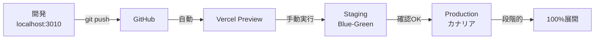

# 🚀 デプロイメントシステムの使い方（実践ガイド）

## 📝 前提条件

以下の設定が完了していることを確認：

- ✅ GitHub Secretsに `VERCEL_TOKEN` を設定済み
- ✅ GitHub Secretsに `VERCEL_ORG_ID` を設定済み
- ✅ GitHub Secretsに `VERCEL_PROJECT_ID` を設定済み

---

## 🎯 デプロイメント方法（3つのアプローチ）

### 方法1: GitHub Actions UI から実行（最も簡単）

#### Blue-Green デプロイメント

1. **GitHubリポジトリを開く**

   ```
   https://github.com/kirikab-27/my-board-app
   ```

2. **「Actions」タブをクリック**

3. **左側のワークフロー一覧から選択**
   - 「Blue-Green Deployment」をクリック

4. **「Run workflow」ボタンをクリック**

5. **パラメータを設定**

   ```
   Deployment environment: staging（または production）
   Deployment strategy: blue-green
   Auto switch after health check: ☑️（自動切り替えする場合）
   ```

6. **緑の「Run workflow」ボタンをクリック**

7. **実行状況を確認**
   - リアルタイムでログを確認可能
   - 各ステップの成功/失敗を確認

#### カナリアデプロイメント

1. 同じく「Actions」タブから
2. 「Canary Deployment」を選択
3. パラメータ設定：
   ```
   Environment: staging
   Initial traffic: 10（%）
   Increment: 20（%）
   ```
4. 実行

---

### 方法2: GitHub CLI から実行（コマンドライン）

#### インストール

```bash
# GitHub CLIをインストール（未インストールの場合）
# Windows (winget)
winget install GitHub.cli

# Mac
brew install gh

# 認証
gh auth login
```

#### デプロイメント実行

```bash
# Blue-Greenデプロイメント実行
gh workflow run blue-green-deploy.yml \
  -f environment=staging \
  -f strategy=blue-green \
  -f auto_switch=true

# カナリアデプロイメント実行
gh workflow run canary-deploy.yml \
  -f environment=staging \
  -f initial_traffic=10 \
  -f increment=20

# 実行状況確認
gh run list --workflow=blue-green-deploy.yml
gh run watch
```

---

### 方法3: API経由で実行（自動化向け）

```bash
# GitHub API経由でワークフロー実行
curl -X POST \
  -H "Accept: application/vnd.github+json" \
  -H "Authorization: Bearer $GITHUB_TOKEN" \
  https://api.github.com/repos/kirikab-27/my-board-app/actions/workflows/blue-green-deploy.yml/dispatches \
  -d '{
    "ref": "main",
    "inputs": {
      "environment": "staging",
      "strategy": "blue-green",
      "auto_switch": "true"
    }
  }'
```

---

## 📊 デプロイメント戦略の選び方

### Blue-Green を選ぶ場合

- ✅ **即座に全ユーザーに反映**したい
- ✅ **ロールバックを素早く**行いたい
- ✅ **A/Bテスト不要**
- ✅ **シンプルな切り替え**を望む

**使用例：**

```yaml
環境: production
戦略: blue-green
自動切り替え: false（手動確認後に切り替え）
```

### カナリアを選ぶ場合

- ✅ **段階的にリリース**したい
- ✅ **リスクを最小化**したい
- ✅ **メトリクス監視**しながら展開
- ✅ **大規模な変更**を含む

**使用例：**

```yaml
環境: production
初期トラフィック: 5%
増分: 10%（30分ごと）
最大エラー率: 3%
```

---

## 🔄 典型的なデプロイメントフロー

### 開発 → ステージング → 本番



### 実際の手順

#### 1. 開発完了後

```bash
# 変更をコミット・プッシュ
git add .
git commit -m "feat: 新機能追加"
git push origin main
```

#### 2. ステージング環境でテスト

```bash
# GitHub Actions UIから
# Blue-Green Deployment実行
# environment: staging
# auto_switch: true
```

#### 3. 本番環境へデプロイ

```bash
# GitHub Actions UIから
# Canary Deployment実行
# environment: production
# initial_traffic: 10
# increment: 20
```

---

## 📈 デプロイメント監視

### 1. GitHub Actions でリアルタイム監視

- Actions タブで実行中のワークフローを確認
- 各ステップのログを確認
- エラー発生時は自動でロールバック

### 2. ヘルスチェック確認

```bash
# ヘルスチェックエンドポイント
curl https://kab137lab.com/api/health

# メトリクス確認
curl https://kab137lab.com/api/metrics
```

### 3. Vercelダッシュボードで確認

- [Vercel Dashboard](https://vercel.com/dashboard)
- Deployments タブで履歴確認
- Functions タブでエラー確認

---

## 🔧 トラブルシューティング

### デプロイメントが始まらない

**確認事項：**

```bash
# GitHub Secretsが設定されているか確認
gh secret list

# ワークフローファイルが存在するか確認
ls -la .github/workflows/
```

### ヘルスチェック失敗

**対処法：**

```bash
# APIエンドポイントを直接確認
curl -v https://your-deployment-url.vercel.app/api/health

# データベース接続を確認
# MongoDB接続文字列が正しいか確認
```

### ロールバックが必要な場合

**手動ロールバック：**

```bash
# Vercel CLIでロールバック
vercel rollback

# または Vercel Dashboard から
# Deployments → 前のバージョン → Promote to Production
```

---

## 🎮 実践例：新機能のリリース

### シナリオ：ユーザープロフィール機能を追加

#### Step 1: 開発・テスト

```bash
# feature ブランチで開発
git checkout -b feature/user-profile
# ... 開発作業 ...
npm run build
npm test
```

#### Step 2: ステージングでBlue-Green

1. GitHub Actions → Blue-Green Deployment
2. environment: `staging`
3. auto_switch: `true`
4. 実行 → 5分で完了

#### Step 3: ステージング確認

```bash
# ステージング環境で動作確認
open https://staging.kab137lab.com
```

#### Step 4: 本番へカナリアデプロイ

1. GitHub Actions → Canary Deployment
2. environment: `production`
3. initial_traffic: `10`
4. 実行 → 段階的に展開

#### Step 5: 監視

```bash
# メトリクス監視
watch -n 30 'curl -s https://kab137lab.com/api/metrics | jq .'

# エラー率が閾値を超えたら自動ロールバック
```

---

## 📋 チェックリスト

### デプロイメント前

- [ ] ローカルでビルド成功確認
- [ ] テストが全て通る
- [ ] 環境変数が設定済み
- [ ] データベース接続確認

### デプロイメント中

- [ ] GitHub Actions監視
- [ ] ヘルスチェック確認
- [ ] エラーログ確認

### デプロイメント後

- [ ] 本番環境で動作確認
- [ ] メトリクス正常
- [ ] ユーザーからのフィードバック確認

---

## 🚨 緊急時の対応

### 即座にロールバック

```bash
# Vercel Dashboard
# Deployments → 安定版を選択 → Promote to Production

# または GitHub Actions
# Blue-Green Deployment → Rollback
```

### サポート連絡先

- GitHub Issues: https://github.com/kirikab-27/my-board-app/issues
- Vercel Support: https://vercel.com/support

---

## 📚 関連ドキュメント

- [環境変数設定ガイド](./DEPLOYMENT_ENV_SETUP.md)
- [Vercel認証情報取得](./VERCEL_CREDENTIALS_GUIDE.md)
- [デプロイメント詳細](./DEPLOYMENT.md)
