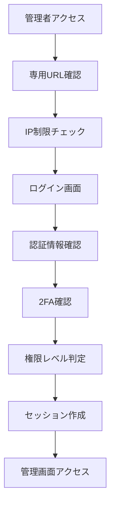

# SNS管理画面アーキテクチャ設計書

## 🏗️ システム全体設計

### **技術アーキテクチャ**

#### **フロントエンド層**
```
┌─────────────────────────────────────┐
│ Admin Frontend (React + Material-UI) │
├─────────────────────────────────────┤
│ • AdminLayout (サイドバー・ナビ)        │
│ • Dashboard (統計・アラート)           │  
│ • UserManagement (一覧・詳細・操作)    │
│ • PostModeration (投稿管理・削除)     │
│ • Analytics (分析・レポート)          │
└─────────────────────────────────────┘
```

#### **認証・認可層**
```
┌─────────────────────────────────────┐
│ Authentication & Authorization      │
├─────────────────────────────────────┤
│ • useAdminAuth (権限チェックフック)     │
│ • AdminMiddleware (API認証)          │
│ • RoleGuard (ページアクセス制御)       │
│ • SessionManager (セッション管理)     │
└─────────────────────────────────────┘
```

#### **API層・データアクセス**
```
┌─────────────────────────────────────┐
│ API Routes (/api/admin/*)           │
├─────────────────────────────────────┤
│ • /api/admin/auth/* (認証API)        │
│ • /api/admin/users/* (ユーザー管理)   │
│ • /api/admin/posts/* (投稿管理)      │
│ • /api/admin/stats/* (統計API)       │
│ • /api/admin/logs/* (監査ログ)       │
└─────────────────────────────────────┘
```

#### **データベース層**
```
┌─────────────────────────────────────┐
│ MongoDB Atlas + Mongoose Models    │
├─────────────────────────────────────┤
│ • AdminUser (管理者拡張)             │
│ • AuditLog (操作ログ)               │
│ • User (既存ユーザー拡張)             │
│ • Post (既存投稿拡張)               │
│ • Report (レポート・統計)            │
└─────────────────────────────────────┘
```

---

## 🗄️ データベース設計

### **管理者ユーザー（AdminUser）**
```typescript
interface AdminUser {
  _id: ObjectId;
  userId: ObjectId;              // 元Userへの参照
  adminLevel: 'admin' | 'moderator' | 'audit';
  
  // 認証・セキュリティ
  adminMetadata: {
    lastAdminLogin: Date;
    loginCount: number;
    allowedIPs: string[];        // IP制限
    twoFactorEnabled: boolean;
    twoFactorSecret?: string;    // TOTP秘密鍵
    emergencyCode?: string;      // 緊急時コード
    isActive: boolean;
    suspendedAt?: Date;
    suspendedBy?: ObjectId;
    suspensionReason?: string;
  };
  
  // メタデータ
  createdBy: ObjectId;           // 作成した管理者
  createdAt: Date;
  updatedAt: Date;
}
```

### **監査ログ（AuditLog）**
```typescript
interface AuditLog {
  _id: ObjectId;
  
  // 実行情報
  adminUserId: ObjectId;         // 実行者
  action: AdminAction;           // 操作タイプ
  targetType: 'user' | 'post' | 'system' | 'report';
  targetId?: ObjectId;           // 対象ID
  
  // セッション・技術情報
  sessionId: string;
  ipAddress: string;
  userAgent: string;
  referrer?: string;
  
  // 操作詳細
  requestData?: object;          // リクエスト内容
  responseData?: object;         // レスポンス内容
  changes?: {                    // 変更前後
    before?: object;
    after?: object;
  };
  
  // 結果・理由
  result: 'success' | 'failure' | 'partial';
  reason?: string;               // 操作理由
  errorMessage?: string;         // エラー詳細
  
  // タイムスタンプ
  timestamp: Date;
  processingTime?: number;       // 処理時間（ms）
}
```

### **レポート・統計（Report）**
```typescript
interface Report {
  _id: ObjectId;
  
  // レポート基本情報
  type: 'user_activity' | 'content_moderation' | 'system_health' | 'security_audit';
  title: string;
  description: string;
  category: string;
  
  // 生成情報
  generatedBy: ObjectId;         // 生成者
  generatedAt: Date;
  parameters: {                  // 生成パラメータ
    dateRange: { start: Date; end: Date };
    filters?: object;
    aggregations?: object;
  };
  
  // データ・結果
  data: object;                  // レポートデータ
  summary: {                     // サマリー統計
    totalRecords: number;
    keyMetrics: object;
    insights?: string[];
  };
  
  // エクスポート
  formats: ['json', 'csv', 'excel', 'pdf'];
  downloadUrls: {
    json?: string;
    csv?: string;
    excel?: string;
    pdf?: string;
  };
  
  // ライフサイクル
  status: 'generating' | 'completed' | 'failed' | 'expired';
  expiresAt: Date;
  downloadCount: number;
}
```

### **既存モデル拡張**

#### **User model 拡張**
```typescript
// 既存 User に追加
interface UserExtension {
  // 管理者用メタデータ
  adminMetadata?: {
    lastModeration?: Date;
    moderationHistory: Array<{
      action: string;
      reason: string;
      moderatorId: ObjectId;
      timestamp: Date;
    }>;
    reportCount: number;
    trustScore: number;          // 信頼スコア（0-100）
  };
  
  // アクティビティ追跡
  activityMetadata?: {
    lastActive: Date;
    sessionDuration: number;
    pageViews: number;
    deviceInfo: string[];
    suspiciousActivity: boolean;
  };
}
```

#### **Post model 拡張**
```typescript
// 既存 Post に追加  
interface PostExtension {
  // モデレーション情報
  moderationData?: {
    status: 'approved' | 'pending' | 'hidden' | 'deleted';
    reviewedBy?: ObjectId;
    reviewedAt?: Date;
    moderationReason?: string;
    autoModerated: boolean;
    spamScore: number;           // スパムスコア（0-100）
  };
  
  // 分析データ
  analyticsData?: {
    viewCount: number;
    shareCount: number;
    reportCount: number;
    engagementRate: number;
    viralityScore: number;       // バイラルスコア
  };
}
```

---

## 🔌 API設計

### **エンドポイント構成**

#### **認証API (/api/admin/auth/)**
```typescript
POST /api/admin/auth/login
POST /api/admin/auth/verify-2fa
POST /api/admin/auth/logout  
GET  /api/admin/auth/session
POST /api/admin/auth/refresh-token
```

#### **ユーザー管理API (/api/admin/users/)**
```typescript
GET    /api/admin/users                    // 一覧・検索
GET    /api/admin/users/[id]               // 詳細
PUT    /api/admin/users/[id]               // 更新
DELETE /api/admin/users/[id]               // 削除
POST   /api/admin/users/[id]/suspend       // 一時停止
POST   /api/admin/users/[id]/restore       // 復活
POST   /api/admin/users/bulk-action        // 一括操作
GET    /api/admin/users/stats              // ユーザー統計
GET    /api/admin/users/export             // エクスポート
```

#### **投稿管理API (/api/admin/posts/)**
```typescript
GET    /api/admin/posts                    // 一覧・検索
GET    /api/admin/posts/[id]               // 詳細
PUT    /api/admin/posts/[id]               // 編集
DELETE /api/admin/posts/[id]               // 削除
POST   /api/admin/posts/[id]/hide          // 非表示
POST   /api/admin/posts/[id]/restore       // 復活
POST   /api/admin/posts/bulk-moderation    // 一括モデレーション
GET    /api/admin/posts/reports            // 報告された投稿
GET    /api/admin/posts/stats              // 投稿統計
```

#### **統計・分析API (/api/admin/stats/)**
```typescript
GET /api/admin/stats/dashboard             // ダッシュボード統計
GET /api/admin/stats/users                 // ユーザー分析
GET /api/admin/stats/posts                 // 投稿分析
GET /api/admin/stats/engagement            // エンゲージメント
GET /api/admin/stats/trends                // トレンド分析
POST /api/admin/stats/custom-report       // カスタムレポート
```

#### **監査ログAPI (/api/admin/logs/)**
```typescript
GET  /api/admin/logs                       // ログ一覧・検索
GET  /api/admin/logs/[id]                  // ログ詳細
POST /api/admin/logs/search               // 高度検索
GET  /api/admin/logs/export               // エクスポート
GET  /api/admin/logs/stats                // ログ統計
```

---

## 🛡️ セキュリティアーキテクチャ

### **認証フロー**


### **権限制御**
```typescript
// Middleware実装例
export async function adminAuthMiddleware(
  req: NextRequest,
  context: { params: { path: string[] } }
) {
  // 1. セッション確認
  const session = await getServerSession(authOptions);
  
  // 2. 管理者権限確認
  if (!['admin', 'moderator', 'audit'].includes(session?.user?.role)) {
    return Response.redirect('/unauthorized');
  }
  
  // 3. IP制限確認
  const clientIP = getClientIP(req);
  if (!isAllowedIP(clientIP)) {
    await logSecurityEvent('ip_restriction_violation', { ip: clientIP });
    return Response.redirect('/access-denied');
  }
  
  // 4. 操作ログ記録
  await logAdminAction(session.user.id, 'page_access', context.params.path);
  
  return NextResponse.next();
}
```

### **データ暗号化・保護**
- **機密データ**: パスワード・2FA秘密鍵・IPアドレス暗号化
- **通信**: HTTPS強制・セキュアCookie・CSRF対策
- **ログ**: 個人情報マスキング・匿名化・保存期間制限

---

## 📱 UI/UXアーキテクチャ

### **レスポンシブレイアウト**

#### **デスクトップ（1200px+）**
```
┌──────────┬────────────────────────┐
│ Sidebar  │ Main Content          │
│ (240px)  │                        │
│          │ Header (管理者モード表示) │
│ Menu     │ ├─ Dashboard          │
│ - ダッシュ │ ├─ User Management    │
│ - ユーザー │ ├─ Post Moderation    │
│ - 投稿    │ ├─ Analytics          │
│ - 分析    │ └─ Settings           │
│ - 設定    │                        │
└──────────┴────────────────────────┘
```

#### **タブレット（768-1199px）**
```
┌─────────────────────────────────────┐
│ Header + Hamburger Menu            │
├─────────────────────────────────────┤
│ Main Content (全幅)                 │
│ ・折りたたみサイドバー               │
│ ・タッチ操作最適化                   │
│ ・重要機能優先表示                   │
└─────────────────────────────────────┘
```

#### **モバイル（768px-）**
```
┌─────────────────────────────────────┐
│ Top Header (管理者モード識別)        │
├─────────────────────────────────────┤
│ Main Content                       │
│ ・簡略化UI                          │
│ ・重要操作のみ                       │
└─────────────────────────────────────┘
│ Bottom Navigation                  │
│ [ダッシュ][ユーザー][投稿][設定]      │
└─────────────────────────────────────┘
```

### **コンポーネント設計**

#### **共通コンポーネント**
```typescript
// AdminLayout - 全ページ共通レイアウト
interface AdminLayoutProps {
  children: React.ReactNode;
  title: string;
  breadcrumb?: BreadcrumbItem[];
  actions?: React.ReactNode;
}

// DataTable - 一覧表示用テーブル
interface DataTableProps<T> {
  data: T[];
  columns: ColumnDef<T>[];
  pagination: PaginationConfig;
  filters: FilterConfig;
  actions: ActionConfig<T>;
  exportOptions: ExportConfig;
}

// StatsCard - 統計表示カード
interface StatsCardProps {
  title: string;
  value: number | string;
  change?: number;
  icon?: React.ReactNode;
  color?: 'primary' | 'secondary' | 'success' | 'error';
}
```

---

## 🔄 データフロー

### **ユーザー管理フロー**
```
1. ユーザー一覧要求 
   → API呼び出し (/api/admin/users)
   → 権限チェック・フィルタ適用
   → データベースクエリ実行
   → 結果返却・操作ログ記録

2. ユーザー操作実行
   → 操作確認ダイアログ
   → API呼び出し (/api/admin/users/[id]/action)
   → 権限・対象妥当性チェック
   → データベース更新・監査ログ記録
   → 結果通知・UI更新
```

### **投稿モデレーションフロー**
```
1. 報告投稿確認
   → 自動分類・優先順位付け
   → 管理者・モデレーターに通知
   → 詳細確認・判定・操作実行
   → 投稿者通知・統計更新
```

---

## 🔒 セキュリティ設計

### **多層セキュリティ**

#### **レイヤー1: ネットワーク**
- **IP制限**: 許可IPリスト・地理的制限
- **DDoS対策**: レート制限・異常検知
- **CDN**: Cloudflare・攻撃フィルタ

#### **レイヤー2: アプリケーション**
- **認証**: 多要素認証・セッション管理
- **認可**: 権限ベースアクセス制御・最小権限原則
- **入力検証**: サニタイゼーション・SQLインジェクション対策

#### **レイヤー3: データ**
- **暗号化**: 機密データ暗号化・キー管理
- **監査**: 全操作ログ・改ざん防止・完全性確認
- **バックアップ**: 定期バックアップ・災害復旧

### **脅威モデル・対策**

#### **外部脅威**
- **不正アクセス**: 強固認証・IP制限・監視
- **DDoS攻撃**: レート制限・CDN・負荷分散
- **データ漏洩**: 暗号化・アクセス制御・監査

#### **内部脅威**
- **権限濫用**: 操作ログ・承認プロセス・監視
- **内部犯行**: 分離された権限・4つ目の原則・監査
- **設定ミス**: 自動チェック・レビュープロセス

---

## 📈 パフォーマンス設計

### **スケーラビリティ**
- **データベース**: インデックス最適化・クエリ最適化
- **API**: キャッシュ戦略・ページング・非同期処理
- **フロントエンド**: 仮想化・遅延読み込み・メモ化

### **監視・メトリクス**
- **パフォーマンス**: レスポンス時間・スループット・リソース使用
- **ユーザビリティ**: 操作時間・エラー率・完了率
- **セキュリティ**: 攻撃検知・異常アクセス・脆弱性スキャン

---

## 🛠️ 開発・デプロイ設計

### **CI/CD パイプライン**
```yaml
# 管理者機能専用パイプライン
admin-feature-pipeline:
  - セキュリティテスト（権限・認証・脆弱性）
  - 管理者機能専用E2Eテスト
  - 既存機能影響テスト
  - セキュリティスキャン・監査
```

### **環境分離**
- **開発環境**: 機能開発・単体テスト・UI確認
- **ステージング**: 統合テスト・セキュリティテスト・レビュー
- **本番環境**: 監視・ログ・バックアップ・災害復旧

---

**重要**: この設計は**セキュリティファースト**で構築され、**my-board-app既存技術との完全互換性**を重視しています。