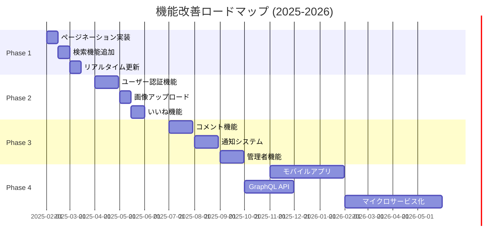

# 今後の改善案

## 1. 改善ロードマップ概要

### 1.1 フェーズ別計画



### 1.2 優先度マトリックス

| 機能 | インパクト | 実装コスト | 優先度 | 実装時期 |
|------|----------|----------|--------|----------|
| ページネーション | 高 | 低 | 🔴 高 | Phase 1 |
| 検索機能 | 高 | 中 | 🔴 高 | Phase 1 |
| ユーザー認証 | 高 | 高 | 🟡 中 | Phase 2 |
| 画像アップロード | 中 | 中 | 🟡 中 | Phase 2 |
| リアルタイム更新 | 中 | 中 | 🟡 中 | Phase 1 |
| モバイルアプリ | 中 | 高 | 🟢 低 | Phase 4 |

## 2. 機能追加のロードマップ

### 2.1 Phase 1: 基本機能強化（2025年2-3月）

#### ページネーション機能
**目的**: 大量投稿時のパフォーマンス改善

**実装内容**:
```typescript
// 新しいAPIエンドポイント設計
// GET /api/posts?page=1&limit=20&sort=createdAt&order=desc

interface IPaginationParams {
  page: number;
  limit: number;
  sort: 'createdAt' | 'updatedAt';
  order: 'asc' | 'desc';
}

interface IPaginatedResponse<T> {
  data: T[];
  pagination: {
    currentPage: number;
    totalPages: number;
    totalItems: number;
    hasNext: boolean;
    hasPrev: boolean;
  };
}
```

**実装手順**:
1. APIエンドポイントの拡張
2. フロントエンドコンポーネント作成
3. 無限スクロール対応
4. SEO対応（URLパラメータ）

#### 検索機能
**目的**: 投稿内容からの情報検索

**実装内容**:
```typescript
// 検索API設計
// GET /api/posts/search?q=検索語&page=1&limit=20

interface ISearchParams {
  query: string;
  page?: number;
  limit?: number;
  dateFrom?: string;
  dateTo?: string;
}

// MongoDB Text Search実装
db.posts.createIndex({ content: "text" }, { default_language: "japanese" });
```

**実装手順**:
1. MongoDB全文検索インデックス作成
2. 検索APIエンドポイント実装
3. 検索UIコンポーネント作成
4. 検索結果ハイライト機能

#### リアルタイム更新（WebSocket）
**目的**: 他ユーザーの投稿をリアルタイムで表示

**実装内容**:
```typescript
// Socket.io導入
// next.config.js
module.exports = {
  async rewrites() {
    return [
      {
        source: '/socket.io/:path*',
        destination: '/api/socket/:path*',
      },
    ];
  },
};

// クライアント側実装
import { io } from 'socket.io-client';

const socket = io();

socket.on('newPost', (post) => {
  setPosts(prev => [post, ...prev]);
});
```

### 2.2 Phase 2: ユーザーエクスペリエンス向上（2025年4-6月）

#### ユーザー認証機能（NextAuth.js）
**目的**: 個人識別、投稿管理の向上

**実装内容**:
```typescript
// NextAuth.js設定
// pages/api/auth/[...nextauth].ts
import NextAuth from 'next-auth';
import GoogleProvider from 'next-auth/providers/google';

export default NextAuth({
  providers: [
    GoogleProvider({
      clientId: process.env.GOOGLE_CLIENT_ID!,
      clientSecret: process.env.GOOGLE_CLIENT_SECRET!,
    }),
  ],
  callbacks: {
    session: ({ session, token }) => ({
      ...session,
      user: {
        ...session.user,
        id: token.sub,
      },
    }),
  },
});

// Userモデル拡張
interface IUser {
  _id: string;
  email: string;
  name: string;
  image?: string;
  createdAt: Date;
}

// Postモデル拡張  
interface IPost {
  _id: string;
  content: string;
  author: IUser;
  createdAt: Date;
  updatedAt: Date;
}
```

#### 画像アップロード機能
**目的**: 投稿の表現力向上

**実装内容**:
```typescript
// Cloudinary統合
import { v2 as cloudinary } from 'cloudinary';

// 画像アップロードAPI
// POST /api/upload/image
export async function POST(request: NextRequest) {
  const formData = await request.formData();
  const file = formData.get('image') as File;
  
  // バリデーション
  if (file.size > 5 * 1024 * 1024) { // 5MB制限
    return NextResponse.json({ error: 'ファイルサイズが大きすぎます' }, { status: 400 });
  }
  
  // Cloudinaryアップロード
  const result = await cloudinary.uploader.upload(buffer, {
    folder: 'board-app-posts',
    transformation: [
      { width: 800, height: 600, crop: 'limit' },
      { quality: 'auto' },
      { format: 'webp' }
    ]
  });
  
  return NextResponse.json({ imageUrl: result.secure_url });
}

// 投稿モデル拡張
interface IPost {
  _id: string;
  content: string;
  images?: string[]; // 画像URL配列
  author: IUser;
  createdAt: Date;
  updatedAt: Date;
}
```

#### いいね機能
**目的**: ユーザーエンゲージメント向上

**実装内容**:
```typescript
// Like モデル
interface ILike {
  _id: string;
  post: string; // Post ID
  user: string; // User ID
  createdAt: Date;
}

// いいね切り替えAPI
// POST /api/posts/[id]/like
export async function POST(request: NextRequest, { params }: { params: { id: string } }) {
  const session = await getServerSession();
  if (!session) {
    return NextResponse.json({ error: 'ログインが必要です' }, { status: 401 });
  }
  
  const existingLike = await Like.findOne({
    post: params.id,
    user: session.user.id
  });
  
  if (existingLike) {
    await Like.deleteOne({ _id: existingLike._id });
    return NextResponse.json({ liked: false });
  } else {
    await Like.create({
      post: params.id,
      user: session.user.id
    });
    return NextResponse.json({ liked: true });
  }
}
```

### 2.3 Phase 3: コミュニティ機能（2025年7-9月）

#### コメント機能
**目的**: 投稿に対するディスカッション促進

**実装内容**:
```typescript
// Comment モデル
interface IComment {
  _id: string;
  content: string;
  post: string; // Post ID
  author: IUser;
  parent?: string; // 返信用の親コメントID
  createdAt: Date;
  updatedAt: Date;
}

// ネストコメント表示
const CommentThread = ({ postId, parentId = null }: ICommentThreadProps) => {
  const [comments, setComments] = useState<IComment[]>([]);
  
  const nestedComments = useMemo(() => {
    return buildCommentTree(comments, parentId);
  }, [comments, parentId]);
  
  return (
    <div className="comment-thread">
      {nestedComments.map(comment => (
        <CommentItem 
          key={comment._id} 
          comment={comment}
          onReply={handleReply}
        />
      ))}
    </div>
  );
};
```

#### 通知システム
**目的**: ユーザーエンゲージメントの継続

**実装内容**:
```typescript
// Notification モデル
interface INotification {
  _id: string;
  recipient: string; // User ID
  sender?: string; // User ID
  type: 'like' | 'comment' | 'reply' | 'mention';
  relatedPost?: string; // Post ID
  relatedComment?: string; // Comment ID
  content: string;
  read: boolean;
  createdAt: Date;
}

// Web Push Notifications
// service-worker.js
self.addEventListener('push', (event) => {
  const options = {
    body: event.data.text(),
    icon: '/icon-192x192.png',
    badge: '/badge-72x72.png',
    actions: [
      { action: 'view', title: '表示' },
      { action: 'dismiss', title: '閉じる' }
    ]
  };
  
  event.waitUntil(
    self.registration.showNotification('掲示板アプリ', options)
  );
});
```

### 2.4 Phase 4: 高度な機能（2025年10月以降）

#### モバイルアプリ（React Native / Flutter）
**目的**: モバイルユーザーの利便性向上

**技術選択**:
```typescript
// React Native Expo推奨
// 理由: 既存のReactスキルセット活用、コードベース共有

// メイン機能
- プッシュ通知
- オフライン対応
- カメラ統合
- デバイス最適化UI
```

#### GraphQL API導入
**目的**: APIの効率性向上、over-fetchingの解決

**実装内容**:
```typescript
// Apollo Server + Next.js
// pages/api/graphql.ts
import { ApolloServer } from 'apollo-server-micro';
import { typeDefs } from '../../graphql/schema';
import { resolvers } from '../../graphql/resolvers';

const apolloServer = new ApolloServer({
  typeDefs,
  resolvers,
  context: ({ req }) => ({ req }),
});

// GraphQL Schema
const typeDefs = gql`
  type Post {
    _id: ID!
    content: String!
    author: User!
    images: [String!]!
    likes: [Like!]!
    comments: [Comment!]!
    createdAt: String!
    updatedAt: String!
  }
  
  type Query {
    posts(limit: Int, offset: Int, search: String): [Post!]!
    post(id: ID!): Post
  }
  
  type Mutation {
    createPost(input: CreatePostInput!): Post!
    updatePost(id: ID!, input: UpdatePostInput!): Post!
    deletePost(id: ID!): Boolean!
  }
`;
```

## 3. パフォーマンス改善案

### 3.1 フロントエンド最適化

#### バンドルサイズ最適化
```typescript
// next.config.js
const withBundleAnalyzer = require('@next/bundle-analyzer')({
  enabled: process.env.ANALYZE === 'true',
});

module.exports = withBundleAnalyzer({
  experimental: {
    optimizePackageImports: ['@mui/material', '@mui/icons-material'],
  },
  
  // 動的インポート推進
  webpack: (config) => {
    config.optimization.splitChunks = {
      chunks: 'all',
      cacheGroups: {
        vendor: {
          test: /[\\/]node_modules[\\/]/,
          name: 'vendors',
          chunks: 'all',
        },
        mui: {
          test: /[\\/]node_modules[\\/]@mui[\\/]/,
          name: 'mui',
          chunks: 'all',
        },
      },
    };
    return config;
  },
});
```

#### 画像最適化
```typescript
// next/image最適化設定
const nextConfig = {
  images: {
    domains: ['res.cloudinary.com'],
    formats: ['image/webp', 'image/avif'],
    deviceSizes: [640, 750, 828, 1080, 1200, 1920, 2048, 3840],
    imageSizes: [16, 32, 48, 64, 96, 128, 256, 384],
  },
};

// 遅延ロード実装
const LazyImage = ({ src, alt, ...props }) => (
  <Image
    src={src}
    alt={alt}
    loading="lazy"
    placeholder="blur"
    blurDataURL="data:image/jpeg;base64,..."
    {...props}
  />
);
```

#### キャッシュ戦略
```typescript
// SWR設定強化
import { SWRConfig } from 'swr';

const swrConfig = {
  revalidateOnFocus: false,
  revalidateOnReconnect: true,
  refreshInterval: 60000, // 1分
  dedupingInterval: 2000,
  errorRetryCount: 3,
  fetcher: (url: string) => fetch(url).then(res => res.json()),
};

// Redis Cache（Vercel KV）
import { kv } from '@vercel/kv';

export async function getCachedPosts(page: number = 1) {
  const cacheKey = `posts:page:${page}`;
  
  let posts = await kv.get(cacheKey);
  if (!posts) {
    posts = await Post.find({})
      .sort({ createdAt: -1 })
      .limit(20)
      .skip((page - 1) * 20);
    
    await kv.set(cacheKey, JSON.stringify(posts), { ex: 300 }); // 5分キャッシュ
  }
  
  return JSON.parse(posts);
}
```

### 3.2 バックエンド最適化

#### データベースインデックス最適化
```javascript
// MongoDB Compass または MongoDB Shellで実行
// 複合インデックス作成
db.posts.createIndex({ "createdAt": -1, "author": 1 });
db.posts.createIndex({ "content": "text", "author": 1 });

// パフォーマンス分析
db.posts.find({ "author": ObjectId("...") }).sort({ "createdAt": -1 }).explain("executionStats");

// インデックス使用状況確認
db.posts.aggregate([
  { $indexStats: {} }
]);
```

#### API応答時間最適化
```typescript
// Connection Pool最適化
mongoose.connect(uri, {
  maxPoolSize: 10,
  minPoolSize: 2,
  maxIdleTimeMS: 30000,
  serverSelectionTimeoutMS: 5000,
  socketTimeoutMS: 45000,
  bufferCommands: false,
  bufferMaxEntries: 0,
});

// クエリ最適化
// Before: N+1問題
const posts = await Post.find({});
const postsWithAuthors = await Promise.all(
  posts.map(async post => ({
    ...post.toObject(),
    author: await User.findById(post.author)
  }))
);

// After: populate使用
const posts = await Post.find({})
  .populate('author', 'name email image')
  .sort({ createdAt: -1 })
  .limit(20);
```

#### Edge Functions活用
```typescript
// middleware.ts（Edge Runtime）
export const config = {
  runtime: 'edge',
  regions: ['nrt1'], // 東京リージョン
};

export function middleware(request: NextRequest) {
  // 地理的ルーティング
  const country = request.geo?.country || 'JP';
  
  if (country !== 'JP') {
    return NextResponse.redirect(new URL('/global', request.url));
  }
  
  return NextResponse.next();
}
```

### 3.3 CDN・静的アセット最適化

#### Vercel Edge Network活用
```typescript
// vercel.json
{
  "headers": [
    {
      "source": "/images/(.*)",
      "headers": [
        {
          "key": "Cache-Control",
          "value": "public, max-age=31536000, immutable"
        }
      ]
    },
    {
      "source": "/api/(.*)",
      "headers": [
        {
          "key": "Cache-Control",
          "value": "public, max-age=60, s-maxage=300"
        }
      ]
    }
  ]
}
```

## 4. セキュリティ強化案

### 4.1 認証・認可強化

#### JWT + Refresh Token実装
```typescript
// lib/auth.ts
import jwt from 'jsonwebtoken';

interface TokenPayload {
  userId: string;
  email: string;
  role: 'user' | 'admin';
}

export function generateTokens(payload: TokenPayload) {
  const accessToken = jwt.sign(payload, process.env.JWT_SECRET!, { 
    expiresIn: '15m' 
  });
  
  const refreshToken = jwt.sign(payload, process.env.JWT_REFRESH_SECRET!, { 
    expiresIn: '7d' 
  });
  
  return { accessToken, refreshToken };
}

// RBAC実装
export function requireRole(roles: string[]) {
  return async (req: NextRequest) => {
    const token = req.headers.get('authorization')?.replace('Bearer ', '');
    const payload = jwt.verify(token!, process.env.JWT_SECRET!) as TokenPayload;
    
    if (!roles.includes(payload.role)) {
      throw new Error('権限がありません');
    }
    
    return payload;
  };
}
```

#### CSP（Content Security Policy）強化
```typescript
// next.config.js
const nextConfig = {
  async headers() {
    return [
      {
        source: '/(.*)',
        headers: [
          {
            key: 'Content-Security-Policy',
            value: [
              "default-src 'self'",
              "script-src 'self' 'unsafe-eval' 'unsafe-inline' https://vercel.live",
              "style-src 'self' 'unsafe-inline' https://fonts.googleapis.com",
              "font-src 'self' https://fonts.gstatic.com",
              "img-src 'self' data: https://res.cloudinary.com",
              "connect-src 'self' https://api.mongodb.com",
            ].join('; ')
          },
          {
            key: 'X-XSS-Protection',
            value: '1; mode=block'
          },
          {
            key: 'X-Frame-Options',
            value: 'DENY'
          },
          {
            key: 'Referrer-Policy',
            value: 'origin-when-cross-origin'
          }
        ]
      }
    ];
  }
};
```

### 4.2 入力検証・サニタイゼーション

#### Zod Validation強化
```typescript
import { z } from 'zod';
import DOMPurify from 'isomorphic-dompurify';

// 投稿バリデーションスキーマ
export const PostSchema = z.object({
  content: z
    .string()
    .min(1, '投稿内容を入力してください')
    .max(2000, '投稿は2000文字以内で入力してください')
    .refine(
      (val) => !/<script|javascript:|data:/i.test(val),
      '不正なコンテンツが含まれています'
    ),
  images: z
    .array(z.string().url())
    .max(5, '画像は5枚まで投稿できます')
    .optional(),
});

// サニタイゼーション関数
export function sanitizeContent(content: string): string {
  return DOMPurify.sanitize(content, {
    ALLOWED_TAGS: ['p', 'br', 'strong', 'em', 'u'],
    ALLOWED_ATTR: []
  });
}
```

#### Rate Limiting強化
```typescript
// lib/rateLimiter.ts
import { kv } from '@vercel/kv';

interface RateLimitConfig {
  windowMs: number;
  maxRequests: number;
  skipSuccessfulRequests?: boolean;
}

export async function rateLimit(
  identifier: string,
  config: RateLimitConfig
): Promise<{ success: boolean; remaining: number; resetTime: number }> {
  const key = `rate_limit:${identifier}`;
  const now = Date.now();
  const window = Math.floor(now / config.windowMs);
  const windowKey = `${key}:${window}`;
  
  const current = await kv.incr(windowKey);
  
  if (current === 1) {
    await kv.expire(windowKey, Math.ceil(config.windowMs / 1000));
  }
  
  const success = current <= config.maxRequests;
  const remaining = Math.max(0, config.maxRequests - current);
  const resetTime = (window + 1) * config.windowMs;
  
  return { success, remaining, resetTime };
}

// 使用例
export async function POST(request: NextRequest) {
  const ip = request.headers.get('x-forwarded-for') || 'anonymous';
  const { success, remaining } = await rateLimit(ip, {
    windowMs: 60 * 1000, // 1分
    maxRequests: 10,
  });
  
  if (!success) {
    return NextResponse.json(
      { error: 'レート制限に達しました' },
      { 
        status: 429,
        headers: {
          'X-RateLimit-Remaining': remaining.toString(),
        }
      }
    );
  }
  
  // 通常の処理...
}
```

## 5. UX改善提案

### 5.1 アクセシビリティ向上

#### WAI-ARIA準拠
```typescript
// アクセシブルなPostFormコンポーネント
const PostForm = () => {
  const [content, setContent] = useState('');
  const [isSubmitting, setIsSubmitting] = useState(false);
  const contentRef = useRef<HTMLTextAreaElement>(null);
  
  return (
    <form onSubmit={handleSubmit} aria-label="投稿作成フォーム">
      <TextField
        ref={contentRef}
        multiline
        rows={4}
        label="投稿内容"
        value={content}
        onChange={(e) => setContent(e.target.value)}
        error={content.length > 200}
        helperText={`${content.length}/200文字`}
        aria-describedby="content-helper-text content-error"
        aria-invalid={content.length > 200}
        inputProps={{
          'aria-label': '投稿内容を入力',
          maxLength: 2000,
        }}
      />
      
      <Button
        type="submit"
        disabled={isSubmitting || content.length === 0 || content.length > 200}
        aria-label={isSubmitting ? '投稿送信中' : '投稿を送信'}
      >
        {isSubmitting ? (
          <>
            <CircularProgress size={16} aria-hidden="true" />
            <span className="sr-only">送信中</span>
            投稿中...
          </>
        ) : (
          '投稿'
        )}
      </Button>
    </form>
  );
};
```

#### キーボードナビゲーション
```typescript
// カスタムフック: useKeyboardNavigation
export function useKeyboardNavigation(items: any[], onSelect: (item: any) => void) {
  const [focusedIndex, setFocusedIndex] = useState(-1);
  
  useEffect(() => {
    const handleKeyDown = (e: KeyboardEvent) => {
      switch (e.key) {
        case 'ArrowDown':
          e.preventDefault();
          setFocusedIndex(prev => 
            prev < items.length - 1 ? prev + 1 : 0
          );
          break;
        case 'ArrowUp':
          e.preventDefault();
          setFocusedIndex(prev => 
            prev > 0 ? prev - 1 : items.length - 1
          );
          break;
        case 'Enter':
          e.preventDefault();
          if (focusedIndex >= 0) {
            onSelect(items[focusedIndex]);
          }
          break;
        case 'Escape':
          setFocusedIndex(-1);
          break;
      }
    };
    
    document.addEventListener('keydown', handleKeyDown);
    return () => document.removeEventListener('keydown', handleKeyDown);
  }, [items, focusedIndex, onSelect]);
  
  return focusedIndex;
}
```

### 5.2 Progressive Web App (PWA)

#### PWA設定
```typescript
// next.config.js
const withPWA = require('next-pwa')({
  dest: 'public',
  disable: process.env.NODE_ENV === 'development',
  register: true,
  skipWaiting: true,
});

module.exports = withPWA({
  // その他の設定...
});

// public/manifest.json
{
  "name": "掲示板アプリ",
  "short_name": "Board App",
  "description": "オープンな掲示板システム",
  "start_url": "/",
  "display": "standalone",
  "background_color": "#ffffff",
  "theme_color": "#1976d2",
  "icons": [
    {
      "src": "/icon-192x192.png",
      "sizes": "192x192",
      "type": "image/png"
    },
    {
      "src": "/icon-512x512.png",
      "sizes": "512x512",
      "type": "image/png"
    }
  ]
}
```

#### オフライン対応
```typescript
// lib/offline.ts
import { openDB } from 'idb';

const DB_NAME = 'board-app-cache';
const DB_VERSION = 1;

export async function initDB() {
  return openDB(DB_NAME, DB_VERSION, {
    upgrade(db) {
      if (!db.objectStoreNames.contains('posts')) {
        const store = db.createObjectStore('posts', { keyPath: '_id' });
        store.createIndex('createdAt', 'createdAt');
      }
    },
  });
}

export async function cachePosts(posts: IPost[]) {
  const db = await initDB();
  const tx = db.transaction('posts', 'readwrite');
  
  await Promise.all(posts.map(post => tx.store.put(post)));
  await tx.done;
}

export async function getCachedPosts(): Promise<IPost[]> {
  const db = await initDB();
  return db.getAllFromIndex('posts', 'createdAt');
}
```

### 5.3 ダークモード・テーマ切り替え

#### テーマシステム
```typescript
// context/ThemeContext.tsx
import { createContext, useContext, useEffect, useState } from 'react';
import { createTheme, ThemeProvider as MUIThemeProvider } from '@mui/material/styles';

type Theme = 'light' | 'dark' | 'auto';

interface ThemeContextType {
  theme: Theme;
  setTheme: (theme: Theme) => void;
  isDark: boolean;
}

const ThemeContext = createContext<ThemeContextType | undefined>(undefined);

export const ThemeProvider = ({ children }: { children: React.ReactNode }) => {
  const [theme, setTheme] = useState<Theme>('auto');
  const [isDark, setIsDark] = useState(false);
  
  useEffect(() => {
    const stored = localStorage.getItem('theme') as Theme;
    if (stored) setTheme(stored);
  }, []);
  
  useEffect(() => {
    localStorage.setItem('theme', theme);
    
    if (theme === 'auto') {
      const mediaQuery = window.matchMedia('(prefers-color-scheme: dark)');
      setIsDark(mediaQuery.matches);
      
      const handler = (e: MediaQueryListEvent) => setIsDark(e.matches);
      mediaQuery.addEventListener('change', handler);
      return () => mediaQuery.removeEventListener('change', handler);
    } else {
      setIsDark(theme === 'dark');
    }
  }, [theme]);
  
  const muiTheme = createTheme({
    palette: {
      mode: isDark ? 'dark' : 'light',
      primary: {
        main: isDark ? '#90caf9' : '#1976d2',
      },
      background: {
        default: isDark ? '#121212' : '#fafafa',
        paper: isDark ? '#1e1e1e' : '#ffffff',
      },
    },
  });
  
  return (
    <ThemeContext.Provider value={{ theme, setTheme, isDark }}>
      <MUIThemeProvider theme={muiTheme}>
        {children}
      </MUIThemeProvider>
    </ThemeContext.Provider>
  );
};

export const useTheme = () => {
  const context = useContext(ThemeContext);
  if (!context) throw new Error('useTheme must be used within ThemeProvider');
  return context;
};
```

## 6. 技術負債の解消

### 6.1 コードリファクタリング計画

#### コンポーネント分割
```typescript
// Before: 大きなコンポーネント
const PostList = ({ posts, onRefresh, onEditPost }) => {
  // 200行のコード...
};

// After: 機能別分割
const PostList = ({ posts, onRefresh, onEditPost }) => (
  <div className="post-list">
    <PostListHeader onRefresh={onRefresh} />
    <PostListBody posts={posts} onEditPost={onEditPost} />
    <PostListFooter />
  </div>
);

const PostListItem = ({ post, onEdit, onDelete }) => (
  <PostCard post={post}>
    <PostContent content={post.content} />
    <PostActions onEdit={onEdit} onDelete={onDelete} />
    <PostMetadata post={post} />
  </PostCard>
);
```

#### Custom Hooks抽出
```typescript
// usePostManagement.ts
export function usePostManagement() {
  const [posts, setPosts] = useState<IPost[]>([]);
  const [loading, setLoading] = useState(true);
  const [error, setError] = useState('');
  
  const { mutate: createPost } = useMutation({
    mutationFn: (content: string) => 
      fetch('/api/posts', { 
        method: 'POST', 
        body: JSON.stringify({ content }) 
      }),
    onSuccess: () => {
      queryClient.invalidateQueries(['posts']);
    },
  });
  
  const { mutate: updatePost } = useMutation({
    mutationFn: ({ id, content }: { id: string; content: string }) =>
      fetch(`/api/posts/${id}`, { 
        method: 'PUT', 
        body: JSON.stringify({ content }) 
      }),
    onSuccess: () => {
      queryClient.invalidateQueries(['posts']);
    },
  });
  
  return {
    posts,
    loading,
    error,
    createPost,
    updatePost,
    // ...other operations
  };
}
```

### 6.2 TypeScript型安全性向上

#### 厳密な型定義
```typescript
// types/api.ts
export interface ApiResponse<T> {
  data?: T;
  error?: string;
  message?: string;
  pagination?: PaginationInfo;
}

export interface PaginationInfo {
  currentPage: number;
  totalPages: number;
  totalItems: number;
  hasNext: boolean;
  hasPrev: boolean;
}

// API関数の型安全化
export async function fetchPosts(
  params: {
    page?: number;
    limit?: number;
    search?: string;
  } = {}
): Promise<ApiResponse<IPost[]>> {
  const searchParams = new URLSearchParams();
  Object.entries(params).forEach(([key, value]) => {
    if (value !== undefined) {
      searchParams.append(key, value.toString());
    }
  });
  
  const response = await fetch(`/api/posts?${searchParams}`);
  if (!response.ok) {
    throw new Error(`HTTP ${response.status}: ${response.statusText}`);
  }
  
  return response.json();
}
```

このロードマップに沿って段階的に機能を拡張し、技術的な改善を継続することで、より堅牢で使いやすい掲示板アプリケーションを構築できます。