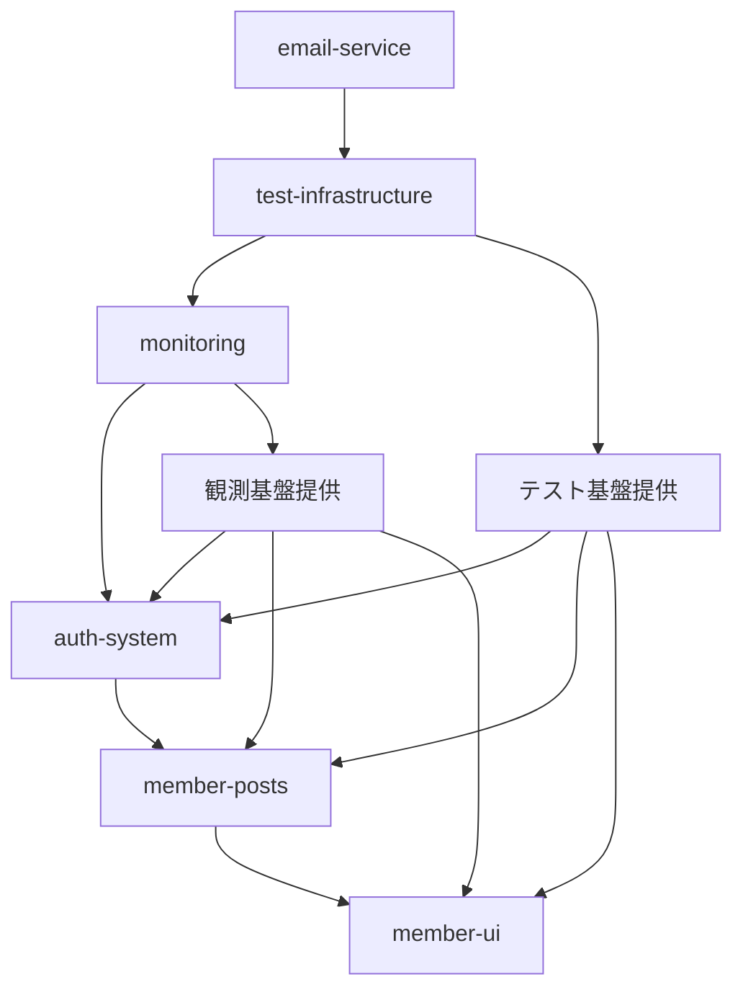

# プロジェクト ブランチ戦略

## 概要

段階的開発・継続的統合戦略を採用し、機能別独立開発から統合完了までの確実な品質管理を実現している。

## ブランチ構成

### 主要ブランチ
- **`master`** - 本番環境ブランチ（Vercel自動デプロイ対象）
- **`develop`** - 開発統合ブランチ（全Phase統合完了済み）
- **`main`** - GitHubメインブランチ（masterと同期）

### 実装済みフィーチャーブランチ（統合完了）
```
feature/email-service           → develop (Phase 2完了)
feature/test-infrastructure     → develop (Phase 0完了)
feature/monitoring             → develop (Phase 0.5完了)
feature/auth-system            → develop (Phase 1-2完了)
feature/member-posts           → develop (Phase 3完了)
feature/member-ui              → develop (Phase 4完了)
feature/admin-panel            → develop (Phase 5完了)
feature/phase6-sns-foundation  → develop (Phase 6.0完了)
```

### Phase 6.1開発中ブランチ
- **`feature/phase6.1-follow-system`** - フォロー機能（開発中）

## Phase 6.1開発フロー（SNS機能実装）

### 開発戦略
機能別独立ブランチ → develop統合 → ビルド確認 → 次機能へ

### 実装順序
1. **フォロー機能** `feature/phase6.1-follow-system` 🚧 **開発中**
2. **タイムライン** `feature/phase6.1-timeline` 📋 計画中
3. **通知システム** `feature/phase6.1-notifications` 📋 計画中
4. **コメント機能** `feature/phase6.1-comments` 📋 計画中
5. **ハッシュタグ** `feature/phase6.1-hashtags` 📋 計画中

### 開発フロー手順
```bash
# 1. 機能別独立ブランチ作成
git checkout develop
git checkout -b feature/phase6.1-[機能名]

# 2. 機能実装・テスト
npm run build  # ビルド確認

# 3. develop統合
git checkout develop
git merge feature/phase6.1-[機能名] --no-ff

# 4. 本番デプロイ（Phase完了時）
git checkout master
git merge develop --no-ff
git push origin master  # Vercel自動デプロイ
```

## 品質管理

### 統合前チェック
- `npm run build` - ビルドエラーチェック必須
- `npm run type-check` - TypeScript型チェック
- `npm run lint` - コード品質確認

### 統合ポリシー
- **No-FF Merge**: 統合履歴保持（`--no-ff`）
- **機能完成主義**: 部分実装での統合禁止
- **段階的統合**: 1機能ずつ確実に統合

## デプロイ戦略

- **開発環境**: develop → localhost:3010
- **本番環境**: master → https://kab137lab.com（Vercel）
- **自動化**: GitHub push → Vercel自動デプロイ

## 過去の実装記録

### Phase 0: テスト基盤・開発環境整備 ✅ **完了**
**ブランチ**: `feature/test-infrastructure`

#### 実装内容
- Jest・Testing Library・Playwright設定
- ESLint・Prettier・Husky設定
- GitHub Actions CI/CD構築
- Docker開発環境整備

#### 成果物
```
tests/
├── __mocks__/              # Mock定義
├── unit/                   # 単体テスト
├── integration/            # 統合テスト
├── e2e/                    # E2Eテスト
└── setup.ts               # テスト設定
.github/workflows/ci.yml    # CI/CDパイプライン
jest.config.js             # Jest設定
```

#### マージ条件
- [ ] 基本テストフレームワークの動作確認
- [ ] CI/CDパイプラインの正常動作
- [ ] カバレッジ目標設定（80%以上）
- [ ] コード品質ゲートの設定

---

### Phase 0.5: 観測基盤構築 (1-2日)
**ブランチ**: `feature/monitoring`

#### 実装内容
- Sentry統合・エラートラッキング
- パフォーマンスメトリクス収集
- ユーザー行動分析基盤
- アラート・ダッシュボード設定

#### 成果物
```
src/lib/monitoring/
├── sentry-config.ts       # Sentry設定
├── performance.ts         # パフォーマンス監視
├── auth-analytics.ts      # 認証分析
└── alerts.ts             # アラート管理
```

#### マージ条件
- [ ] エラートラッキングの動作確認
- [ ] パフォーマンス指標の収集確認
- [ ] アラート通知の動作確認
- [ ] ダッシュボードの基本機能

---

### Phase 1: 認証基盤構築 (3日)
**ブランチ**: `feature/auth-system`

#### 実装内容
- NextAuth.js設定・MongoDB Adapter
- ユーザーモデル・セッション管理
- 基本ログイン/ログアウト機能
- パスワードハッシュ化（bcrypt）

#### 成果物
```
src/
├── lib/
│   └── auth/
│       ├── config.ts          # NextAuth設定
│       ├── options.ts         # 認証オプション
│       └── providers.ts       # 認証プロバイダー
├── models/
│   ├── User.ts                # ユーザーモデル
│   └── Account.ts             # アカウントモデル
└── app/
    ├── api/
    │   └── auth/
    │       └── [...nextauth]/route.ts
    └── auth/
        ├── signin/page.tsx    # ログイン画面
        └── signup/page.tsx    # 登録画面
```

#### マージ条件
- [ ] ログイン/ログアウト機能の動作確認
- [ ] セッション管理の正常動作
- [ ] パスワードハッシュ化の確認
- [ ] 基本的なエラーハンドリング

---

### Phase 2: メール認証統合 (2日)
**ブランチ**: `feature/auth-system`（継続）

#### 実装内容
- 既存メール基盤との統合
- メール認証フロー実装
- パスワードリセット機能
- 認証メールテンプレート

#### 成果物
```
src/
├── lib/
│   └── email/
│       ├── auth-templates.ts  # 認証メールテンプレート
│       └── auth-sender.ts     # 認証メール送信
└── app/
    ├── api/
    │   └── auth/
    │       ├── register/route.ts
    │       ├── verify-email/route.ts
    │       └── reset-password/route.ts
    └── auth/
        ├── verify-email/page.tsx
        └── reset-password/page.tsx
```

#### マージ条件
- [ ] メール認証フローの完全動作
- [ ] パスワードリセットの動作確認
- [ ] DKIM/SPF署名付きメール送信確認
- [ ] 既存メール基盤との統合確認

---

### Phase 3: 会員制投稿機能 (1日)
**ブランチ**: `feature/member-posts`

#### 実装内容
- 投稿機能への認証統合
- 投稿者情報の表示
- 権限ベースのアクセス制御
- API認証ミドルウェア

#### 成果物
```
src/
├── middleware.ts              # 認証ミドルウェア
├── lib/
│   └── auth/
│       └── guards.ts          # 認証ガード
└── app/
    ├── api/
    │   └── posts/
    │       ├── route.ts       # 認証付きAPI
    │       └── [id]/route.ts  # 権限チェック付き
    └── posts/
        └── [id]/
            └── page.tsx       # 認証状態表示
```

#### マージ条件
- [ ] 未認証ユーザーの投稿機能アクセス制限
- [ ] 投稿者名の正常表示
- [ ] 自分の投稿のみ編集・削除可能
- [ ] API認証チェックの動作確認

---

### Phase 4: 会員UI・UX (1日)
**ブランチ**: `feature/member-ui`

#### 実装内容
- 認証状態に応じたUI変更
- ログイン/ログアウトボタン
- ユーザープロフィール表示
- ローディング・エラー状態の改善

#### 成果物
```
src/
├── components/
│   ├── auth/
│   │   ├── AuthButton.tsx     # ログイン/ログアウト
│   │   ├── UserProfile.tsx    # プロフィール表示
│   │   └── AuthGuard.tsx      # 認証ガード
│   └── ui/
│       ├── AuthRequired.tsx   # 認証必須表示
│       └── LoadingAuth.tsx    # 認証確認中
└── app/
    ├── profile/page.tsx       # プロフィール管理
    └── layout.tsx             # 認証状態統合
```

#### マージ条件
- [ ] 認証状態の正確な表示
- [ ] スムーズなログイン/ログアウトUX
- [ ] レスポンシブ対応の確認
- [ ] ローディング・エラー状態の改善

---

### Phase 5: セキュリティ強化 (1日)
**ブランチ**: `feature/member-ui`（継続）

#### 実装内容
- CSRF保護の強化
- レート制限の実装
- バリデーション強化
- セキュリティヘッダー設定

#### 成果物
```
src/
├── lib/
│   ├── security/
│   │   ├── rate-limit.ts      # レート制限
│   │   ├── validation.ts      # 入力バリデーション
│   │   └── csrf.ts            # CSRF保護
│   └── utils/
│       └── security.ts        # セキュリティユーティリティ
└── middleware.ts              # セキュリティミドルウェア
```

#### マージ条件
- [ ] CSRF保護の動作確認
- [ ] レート制限の正常動作
- [ ] バリデーションエラーの適切な処理
- [ ] セキュリティヘッダーの設定確認

## ブランチ運用ルール

### Phase 0開始時（テスト基盤）
```bash
# 最新のemail-serviceブランチから開始
git checkout feature/email-service
git pull origin feature/email-service

# テスト基盤ブランチ作成
git checkout -b feature/test-infrastructure
```

### Phase 0完了・Phase 0.5開始時
```bash
# Phase 0をdevelopにマージ
git checkout develop
git merge feature/test-infrastructure
git tag phase-0-complete

# Phase 0.5ブランチ作成
git checkout feature/test-infrastructure
git checkout -b feature/monitoring
```

### Phase 0.5完了・Phase 1開始時
```bash
# Phase 0.5をdevelopにマージ
git checkout develop 
git merge feature/monitoring
git tag phase-0.5-complete

# Phase 1ブランチ作成（テスト・監視基盤を継承）
git checkout feature/monitoring
git checkout -b feature/auth-system
```

### 各Phase完了時の標準手順
```bash
# 1. 変更をコミット
git add .
git commit -m "feat: Phase [N] - [実装内容]

🤖 Generated with [Claude Code](https://claude.ai/code)

Co-Authored-By: Claude <noreply@anthropic.com>"

# 2. developブランチにマージ（PR経由推奨）
git checkout develop
git merge feature/[ブランチ名]

# 3. 完了タグ付け
git tag phase-[N]-complete

# 4. 次ブランチ作成（必要な場合）
git checkout feature/[前ブランチ名]
git checkout -b feature/[次ブランチ名]
```

## テスト・レビュー戦略

### 各Phase完了時のチェック
1. **機能テスト**: 実装機能の動作確認
2. **統合テスト**: 既存機能との統合確認
3. **セキュリティテスト**: 認証・権限の確認
4. **UI/UXテスト**: ユーザビリティの確認

### レビューポイント
- **コード品質**: TypeScript型安全・エラーハンドリング
- **セキュリティ**: 認証・認可・バリデーション
- **パフォーマンス**: データベースクエリ・レスポンス時間
- **保守性**: コード構造・ドキュメント

## ブランチ間の依存関係とリスク管理

### 強化された7段階依存関係


### 各Phase間の継承関係
| Phase | 継承元 | 提供要素 | 依存ブランチ |
|-------|--------|----------|-------------|
| **0** | email-service | テスト基盤 | なし |
| **0.5** | test-infrastructure | 観測基盤 | Phase 0必須 |
| **1** | monitoring | 認証基盤 | Phase 0+0.5必須 |
| **2** | auth-system | メール認証 | Phase 0+0.5+1必須 |
| **3** | auth-system | 会員投稿 | Phase 1-2必須 |
| **4** | member-posts | UI改善 | Phase 1-3必須 |
| **5** | member-ui | セキュリティ | Phase 1-4必須 |

### リスク軽減策
#### 基盤Phaseの重要性
- **Phase 0破綻時**: 全体実装が困難 → 即座修復必須
- **Phase 0.5破綻時**: 品質可視性低下 → 代替監視手段
- **Phase 1破綻時**: 認証機能全停止 → カナリアリリース必須

#### 並行開発の可能性
```bash
# Phase 0, 0.5完了後は一部並行開発可能
# ただし、基盤機能への影響に注意

# 安全な並行開発例
feature/monitoring (Phase 0.5) ← 完了
├── feature/auth-system (Phase 1-2)
├── feature/performance-tuning (独立)
└── feature/ui-components (Phase 4準備)
```

### ロールバック戦略の強化
#### タグ付けルール更新
```bash
# 各Phase開始・完了時のタグ
git tag phase-0-start        # テスト基盤開始
git tag phase-0-complete     # テスト基盤完了
git tag phase-0.5-start      # 観測基盤開始  
git tag phase-0.5-complete   # 観測基盤完了
# ... 以下同様
```

#### 段階的ロールバック
```bash
# 問題発生Phaseに応じたロールバック
case "$FAILED_PHASE" in
  "0"|"0.5")
    # 基盤Phase失敗 → email-serviceまで戻る
    git checkout feature/email-service
    ;;
  "1"|"2")
    # 認証Phase失敗 → 観測基盤まで戻る
    git checkout phase-0.5-complete
    ;;
  "3"|"4"|"5")
    # 機能Phase失敗 → 認証基盤まで戻る  
    git checkout phase-2-complete
    ;;
esac
```

## ドキュメント更新

### 各Phase完了時
- CLAUDE.mdの実装状況更新
- README-*.mdファイルの更新
- APIドキュメントの更新
- トラブルシューティング情報の追加

### 最終完了時
- 全体設計書の最終更新
- 運用ガイドの作成
- セキュリティガイドの作成