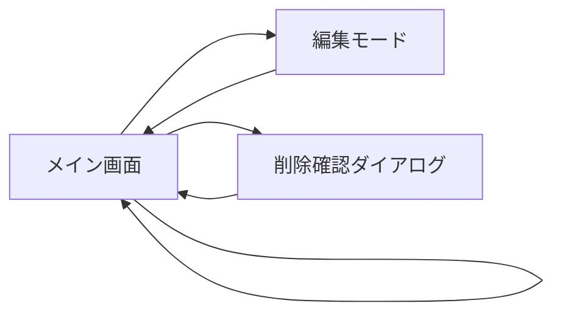

# 画面仕様書

## 1. 画面一覧

| 画面ID | 画面名 | 説明 | ファイルパス |
|--------|--------|------|-------------|
| SC001 | メイン画面 | 投稿の作成・一覧表示・編集・削除を行う画面 | src/app/page.tsx |

## 2. 画面詳細

### 2.1 メイン画面（SC001）

#### 2.1.1 画面構成

```
┌────────────────────────────────────────────────┐
│  ┌──────────────────────────────────────────┐  │
│  │  掲示板アプリ                             │  │ ← ヘッダー（AppBar）
│  └──────────────────────────────────────────┘  │
│                                                 │
│  ┌──────────────────────────────────────────┐  │
│  │  【新しい投稿】                           │  │ ← 投稿フォーム（PostForm）
│  │  ┌────────────────────────────────────┐  │  │
│  │  │ 投稿内容を入力してください          │  │  │
│  │  │ （200文字以内）                     │  │  │
│  │  │                                      │  │  │
│  │  └────────────────────────────────────┘  │  │
│  │  0/200文字                                │  │
│  │  [投稿]                                   │  │
│  └──────────────────────────────────────────┘  │
│                                                 │
│  【投稿一覧】                                   │
│  ┌──────────────────────────────────────────┐  │
│  │  投稿内容がここに表示されます            │  │ ← 投稿リスト（PostList）
│  │  投稿日時: 2025/01/20 10:30:00     [⋮]  │  │
│  └──────────────────────────────────────────┘  │
│  ┌──────────────────────────────────────────┐  │
│  │  別の投稿内容                            │  │
│  │  投稿日時: 2025/01/20 09:15:00     [⋮]  │  │
│  └──────────────────────────────────────────┘  │
└────────────────────────────────────────────────┘
```

#### 2.1.2 コンポーネント構成

| コンポーネント名 | 説明 | ファイル |
|-----------------|------|----------|
| AppBar | アプリケーションヘッダー | src/app/page.tsx |
| PostForm | 投稿作成・編集フォーム | src/components/PostForm.tsx |
| PostList | 投稿一覧表示 | src/components/PostList.tsx |

### 2.2 投稿フォーム（PostForm）

#### 2.2.1 表示項目

| 項目名 | 種別 | 説明 | 制約 |
|--------|------|------|------|
| タイトル | ラベル | 「新しい投稿」または「投稿を編集」 | - |
| 投稿内容 | テキストエリア | 投稿内容入力欄 | 必須、最大200文字 |
| 文字数カウンター | テキスト | 現在の文字数/最大文字数 | リアルタイム更新 |
| 投稿ボタン | ボタン | 投稿を送信 | 新規作成時：「投稿」<br>編集時：「更新」 |
| キャンセルボタン | ボタン | 編集をキャンセル | 編集時のみ表示 |

#### 2.2.2 動作仕様

##### 新規投稿モード
1. タイトルに「新しい投稿」を表示
2. 投稿内容欄は空欄
3. 投稿ボタンのラベルは「投稿」
4. キャンセルボタンは非表示

##### 編集モード
1. タイトルに「投稿を編集」を表示
2. 投稿内容欄に既存の投稿内容を表示
3. 投稿ボタンのラベルは「更新」
4. キャンセルボタンを表示

##### バリデーション
- 空白のみの投稿は不可
- 200文字を超える投稿は不可
- エラー時は赤色のアラートでメッセージ表示

### 2.3 投稿リスト（PostList）

#### 2.3.1 表示項目（各投稿）

| 項目名 | 種別 | 説明 | 表示仕様 |
|--------|------|------|----------|
| 投稿内容 | テキスト | 投稿の本文 | 改行を含めて表示（whiteSpace: 'pre-wrap'） |
| 投稿日時 | テキスト | 投稿作成日時 | 形式：YYYY/MM/DD HH:mm:ss |
| 更新日時 | テキスト | 投稿更新日時 | 更新された場合のみ表示 |
| メニューボタン | アイコンボタン | 編集・削除メニューを開く | 縦3点アイコン（⋮） |

#### 2.3.2 コンテキストメニュー

| メニュー項目 | アイコン | 動作 |
|-------------|---------|------|
| 編集 | 📝 | 投稿を編集モードで開く |
| 削除 | 🗑️ | 削除確認ダイアログを表示 |

#### 2.3.3 削除確認ダイアログ

##### 表示内容
- タイトル：「投稿を削除」
- メッセージ：「この投稿を削除してもよろしいですか？」
- 削除対象の投稿内容をプレビュー表示

##### ボタン
- キャンセル：ダイアログを閉じる
- 削除：投稿を削除してダイアログを閉じる

### 2.4 ローディング・エラー表示

#### 2.4.1 ローディング表示
- CircularProgressコンポーネントを中央に表示
- 初回データ取得時に表示

#### 2.4.2 エラー表示
- Material-UI Alertコンポーネント（severity="error"）
- エラーメッセージを日本語で表示
- 表示位置：該当するコンポーネント内

## 3. 画面遷移



※ シングルページアプリケーションのため、実際の画面遷移はなく、すべて同一画面内での状態変更

## 4. レスポンシブデザイン

### 4.1 ブレークポイント
Material-UIのデフォルトブレークポイントを使用：
- xs: 0px〜599px（スマートフォン）
- sm: 600px〜959px（タブレット）
- md: 960px〜1279px（小型デスクトップ）
- lg: 1280px〜1919px（デスクトップ）
- xl: 1920px〜（大型デスクトップ）

### 4.2 レスポンシブ対応
- Container maxWidth="md"により、最大幅を制限
- Material-UIコンポーネントの自動レスポンシブ対応
- テキストエリアは画面幅に応じて自動調整

## 5. アクセシビリティ

### 5.1 実装済み機能
- Material-UIコンポーネントによる基本的なアクセシビリティ対応
- ボタンのdisabled状態の視覚的フィードバック
- エラーメッセージの明確な表示

### 5.2 キーボード操作
- Tabキーによるフォーカス移動
- Enterキーによるフォーム送信
- Escapeキーによるダイアログクローズ

## 6. UIコンポーネント一覧

| コンポーネント | 用途 | Material-UIコンポーネント |
|---------------|------|-------------------------|
| ヘッダー | アプリケーションタイトル表示 | AppBar, Toolbar |
| 投稿フォーム | 投稿の作成・編集 | Paper, TextField, Button |
| 投稿カード | 個別投稿の表示 | Paper, Typography |
| メニュー | 編集・削除オプション | Menu, MenuItem |
| ダイアログ | 削除確認 | Dialog, DialogTitle, DialogContent, DialogActions |
| アラート | エラー表示 | Alert |
| プログレス | ローディング表示 | CircularProgress |

## 7. カラースキーム

Material-UIのデフォルトテーマをカスタマイズ：

| 要素 | カラーコード | 用途 |
|------|------------|------|
| Primary | #1976d2 | ボタン、AppBar |
| Secondary | #dc004e | アクセント |
| Error | #f44336 | エラーメッセージ、削除ボタン |
| Background | #fafafa | 背景色 |
| Surface | #ffffff | カード、ダイアログ |
| Text Primary | rgba(0,0,0,0.87) | 主要テキスト |
| Text Secondary | rgba(0,0,0,0.6) | 補助テキスト |

## 8. フォント

- フォントファミリー：Roboto, "Helvetica Neue", Arial, sans-serif
- 日本語フォント：システムデフォルト

## 9. アニメーション

- Material-UIのデフォルトトランジション
- ダイアログ：フェードイン/アウト
- メニュー：スライドダウン/アップ
- ボタン：リップルエフェクト