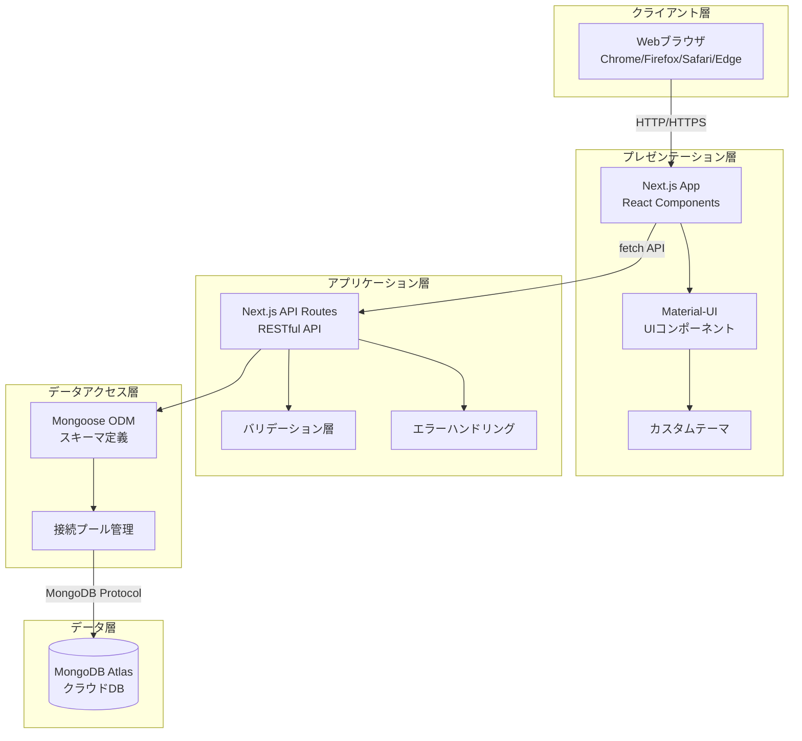
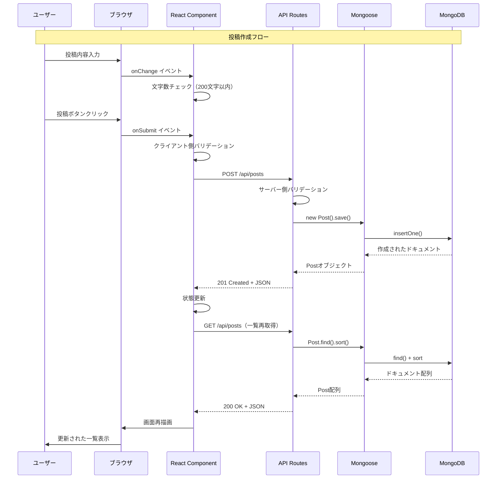

# システム構成図

## 1. システムアーキテクチャ全体図

### 1.1 概要図



### 1.2 詳細なコンポーネント間通信フロー



## 2. 使用技術スタック詳細

### 2.1 フロントエンド技術

| 技術 | バージョン | 用途 | 説明 |
|------|-----------|------|------|
| **Next.js** | 15.4.5 | フレームワーク | React用のフルスタックフレームワーク。サーバーサイドレンダリング（SSR）やAPIルートを提供 |
| **React** | 19.1.0 | UIライブラリ | ユーザーインターフェースを構築するためのJavaScriptライブラリ |
| **TypeScript** | 5.x | プログラミング言語 | JavaScriptに型定義を追加した言語。コードの安全性を向上 |
| **Material-UI (MUI)** | 7.2.0 | UIコンポーネント | Googleのマテリアルデザインに基づいたReactコンポーネント集 |
| **@mui/icons-material** | 7.2.0 | アイコン集 | Material-UI用のアイコンセット |
| **Emotion** | 11.14.0 | CSS-in-JS | JavaScriptでCSSを記述するためのライブラリ |
| **Tailwind CSS** | 4.x | CSSフレームワーク | ユーティリティファーストのCSSフレームワーク（現在は限定的使用） |

### 2.2 バックエンド技術

| 技術 | バージョン | 用途 | 説明 |
|------|-----------|------|------|
| **Next.js API Routes** | 15.4.5 | APIサーバー | Next.js内蔵のサーバーレスAPI機能 |
| **Node.js** | 18.x以上 | 実行環境 | JavaScriptをサーバーサイドで実行するための環境 |

### 2.3 データベース関連

| 技術 | バージョン | 用途 | 説明 |
|------|-----------|------|------|
| **MongoDB** | 6.x | データベース | ドキュメント型のNoSQLデータベース |
| **Mongoose** | 8.17.0 | ODM | MongoDBをJavaScriptで扱いやすくするためのライブラリ |
| **MongoDB Atlas** | - | クラウドDB | MongoDBのクラウドホスティングサービス |

### 2.4 開発ツール

| 技術 | バージョン | 用途 | 説明 |
|------|-----------|------|------|
| **ESLint** | 9.x | リンター | コードの品質チェックツール |
| **Turbopack** | - | ビルドツール | Next.js用の高速ビルドツール（開発時） |

## 3. ディレクトリ構造と役割

```
my-board-app/
├── src/                        # ソースコード
│   ├── app/                   # Next.js App Router
│   │   ├── api/              # APIエンドポイント
│   │   │   └── posts/        # 投稿関連API
│   │   │       ├── route.ts         # GET（一覧）, POST（作成）
│   │   │       └── [id]/route.ts    # PUT（更新）, DELETE（削除）
│   │   ├── layout.tsx        # ルートレイアウト（共通部分）
│   │   └── page.tsx          # メインページ
│   ├── components/           # Reactコンポーネント
│   │   ├── PostForm.tsx     # 投稿フォーム
│   │   ├── PostList.tsx     # 投稿一覧
│   │   └── ThemeProvider.tsx # テーマ設定
│   ├── lib/                  # ライブラリ・ユーティリティ
│   │   └── mongodb.ts        # DB接続管理
│   ├── models/               # データモデル
│   │   └── Post.ts           # 投稿スキーマ
│   ├── theme/                # テーマ設定
│   │   └── theme.ts          # MUIテーマカスタマイズ
│   └── types/                # 型定義
│       └── global.d.ts       # グローバル型定義
├── docs/                      # ドキュメント
├── public/                    # 静的ファイル
├── .env.local                # 環境変数（Git管理外）
├── package.json              # 依存関係・スクリプト
├── tsconfig.json            # TypeScript設定
└── next.config.js           # Next.js設定
```

## 4. データフロー詳細

### 4.1 CRUD操作のデータフロー

#### CREATE（投稿作成）
```
1. ユーザー入力
   ↓
2. PostForm.tsx（クライアント側バリデーション）
   ↓
3. fetch('/api/posts', { method: 'POST' })
   ↓
4. route.ts（サーバー側バリデーション）
   ↓
5. new Post(data).save()（Mongoose）
   ↓
6. MongoDB Insert
   ↓
7. レスポンス返却（201 Created）
   ↓
8. 画面更新
```

#### READ（投稿一覧取得）
```
1. ページロード or リフレッシュ
   ↓
2. useEffect（page.tsx）
   ↓
3. fetch('/api/posts')
   ↓
4. Post.find().sort({ createdAt: -1 })
   ↓
5. MongoDB Query
   ↓
6. レスポンス返却（200 OK）
   ↓
7. setState更新
   ↓
8. PostList.tsx再レンダリング
```

## 5. パフォーマンス問題と対処法

### 5.1 よくあるパフォーマンス問題

#### 問題1: データベース接続の遅延
**症状**
```
エラー: MongooseServerSelectionError: connection timed out
```

**原因**
- MongoDB Atlasへの接続が遅い
- 接続プールが枯渇している

**解決策**
```javascript
// src/lib/mongodb.ts の最適化
const opts = {
  bufferCommands: false,
  maxPoolSize: 10,        // 接続プール最大数
  minPoolSize: 2,         // 接続プール最小数
  socketTimeoutMS: 45000, // ソケットタイムアウト
};
```

#### 問題2: 大量データでの表示遅延
**症状**
- 投稿が1000件を超えると一覧表示が遅い

**解決策**
```javascript
// ページネーションの実装
// src/app/api/posts/route.ts
export async function GET(request: NextRequest) {
  const { searchParams } = new URL(request.url);
  const page = parseInt(searchParams.get('page') || '1');
  const limit = parseInt(searchParams.get('limit') || '20');
  const skip = (page - 1) * limit;
  
  const posts = await Post.find({})
    .sort({ createdAt: -1 })
    .limit(limit)
    .skip(skip);
    
  const total = await Post.countDocuments();
  
  return NextResponse.json({
    posts,
    totalPages: Math.ceil(total / limit),
    currentPage: page
  });
}
```

#### 問題3: 初回ロードの遅延
**症状**
- ページの初回表示が遅い

**解決策**
```javascript
// サーバーサイドレンダリング（SSR）の活用
// src/app/page.tsx を Server Component に変更
export default async function Home() {
  const posts = await getPosts(); // サーバー側でデータ取得
  return <ClientComponent initialPosts={posts} />;
}
```

### 5.2 パフォーマンス監視

```javascript
// パフォーマンス測定コード例
console.time('Database Query');
const posts = await Post.find({}).sort({ createdAt: -1 });
console.timeEnd('Database Query');
// 出力: Database Query: 45.123ms
```

## 6. 本番環境へのデプロイ

### 6.1 Vercelへのデプロイ（推奨）

#### 手順
```bash
# 1. Vercel CLIインストール
npm install -g vercel

# 2. プロジェクトをVercelにリンク
vercel

# 3. 環境変数設定
# Vercelダッシュボードで以下を設定：
# MONGODB_URI=mongodb+srv://...

# 4. デプロイ実行
vercel --prod
```

#### 注意点
- 環境変数は必ずVercelダッシュボードで設定
- `.env.local`はGitにコミットしない
- MongoDB AtlasのIPホワイトリストに0.0.0.0/0を追加（全IP許可）

### 6.2 その他のホスティングサービス

#### Netlify
```bash
# next.config.js に追加
module.exports = {
  output: 'export', // 静的エクスポート
}

# ビルド
npm run build
npm run export

# Netlifyにデプロイ
netlify deploy --dir=out --prod
```

#### Railway/Render
```yaml
# railway.toml または render.yaml
services:
  - type: web
    name: board-app
    env: node
    buildCommand: npm install && npm run build
    startCommand: npm start
    envVars:
      - key: MONGODB_URI
        value: mongodb+srv://...
```

### 6.3 本番環境のセキュリティ設定

#### 必須設定項目
```javascript
// next.config.js
module.exports = {
  headers: async () => [
    {
      source: '/(.*)',
      headers: [
        {
          key: 'X-Frame-Options',
          value: 'DENY', // クリックジャッキング対策
        },
        {
          key: 'X-Content-Type-Options',
          value: 'nosniff', // MIMEタイプスニッフィング防止
        },
        {
          key: 'X-XSS-Protection',
          value: '1; mode=block', // XSS対策
        },
      ],
    },
  ],
};
```

#### MongoDB Atlas セキュリティ
```
1. IPホワイトリスト設定
   - 開発: ローカルIPのみ
   - 本番: ホスティングサービスのIP

2. データベースユーザー権限
   - readWrite権限のみ付与
   - 管理者権限は付与しない

3. 接続文字列
   - SSL/TLS有効化
   - retryWrites=true設定
```

## 7. トラブルシューティング

### 7.1 よくあるエラーと解決法

#### エラー1: Module not found
```bash
エラー: Module not found: Can't resolve '@/components/PostForm'

# 解決法
# tsconfig.json の paths設定を確認
{
  "compilerOptions": {
    "paths": {
      "@/*": ["./src/*"]
    }
  }
}
```

#### エラー2: MongoDB接続エラー
```bash
エラー: MongooseServerSelectionError: connect ECONNREFUSED

# 解決法
# 1. MongoDB Atlasの接続文字列確認
echo $MONGODB_URI

# 2. ネットワーク接続確認
ping cluster0.mongodb.net

# 3. IPホワイトリスト確認（MongoDB Atlas）
# Current IP Addressを追加
```

#### エラー3: ビルドエラー
```bash
エラー: Type error: Property 'content' does not exist

# 解決法
# 1. TypeScript型定義を確認
interface Post {
  _id: string;
  content: string;
  createdAt: string;
  updatedAt: string;
}

# 2. クリーンビルド
rm -rf .next
npm run build
```

### 7.2 デバッグ方法

#### サーバーサイドデバッグ
```javascript
// API Routes内でのデバッグ
export async function POST(request: NextRequest) {
  console.log('=== DEBUG START ===');
  const body = await request.json();
  console.log('Request body:', body);
  
  try {
    // 処理
  } catch (error) {
    console.error('Error details:', {
      message: error.message,
      stack: error.stack,
      body: body
    });
  }
  console.log('=== DEBUG END ===');
}
```

#### クライアントサイドデバッグ
```javascript
// React Developer Tools使用
// Chrome拡張機能をインストール

// コンポーネント内デバッグ
useEffect(() => {
  console.group('PostList Debug');
  console.log('Posts count:', posts.length);
  console.log('Loading state:', loading);
  console.log('Error state:', error);
  console.groupEnd();
}, [posts, loading, error]);
```

## 8. パフォーマンス最適化チェックリスト

### 8.1 フロントエンド最適化

- [ ] 不要な再レンダリング防止（React.memo使用）
- [ ] 大きなリストの仮想スクロール実装
- [ ] 画像の遅延ロード（将来的に画像追加時）
- [ ] バンドルサイズの最適化
- [ ] コード分割（動的インポート）

### 8.2 バックエンド最適化

- [ ] データベースインデックス追加
- [ ] クエリの最適化（必要なフィールドのみ取得）
- [ ] キャッシュの実装（Redis等）
- [ ] レート制限の実装
- [ ] gzip圧縮の有効化

### 8.3 インフラ最適化

- [ ] CDN使用（静的アセット配信）
- [ ] エッジ関数の活用（Vercel Edge Functions）
- [ ] データベースリージョン最適化
- [ ] 自動スケーリング設定

## 9. 監視とログ

### 9.1 アプリケーション監視

```javascript
// Sentryの導入例
// npm install @sentry/nextjs

// sentry.client.config.js
import * as Sentry from "@sentry/nextjs";

Sentry.init({
  dsn: process.env.NEXT_PUBLIC_SENTRY_DSN,
  tracesSampleRate: 1.0,
});
```

### 9.2 パフォーマンス監視

```javascript
// Web Vitals測定
// src/app/layout.tsx
export function reportWebVitals(metric) {
  console.log(metric);
  // Google Analyticsに送信
  gtag('event', metric.name, {
    value: Math.round(metric.value),
    metric_id: metric.id,
    metric_value: metric.value,
    metric_delta: metric.delta,
  });
}
```

## 10. 今後の拡張計画

### 10.1 機能拡張ロードマップ

1. **Phase 1（短期）**
   - ページネーション実装
   - 検索機能追加
   - リアルタイム更新（WebSocket）

2. **Phase 2（中期）**
   - ユーザー認証機能
   - 画像アップロード
   - いいね機能

3. **Phase 3（長期）**
   - コメント機能
   - 通知システム
   - モバイルアプリ開発

### 10.2 技術的改善計画

- GraphQL APIへの移行検討
- マイクロサービス化
- Kubernetes導入
- CI/CDパイプライン強化